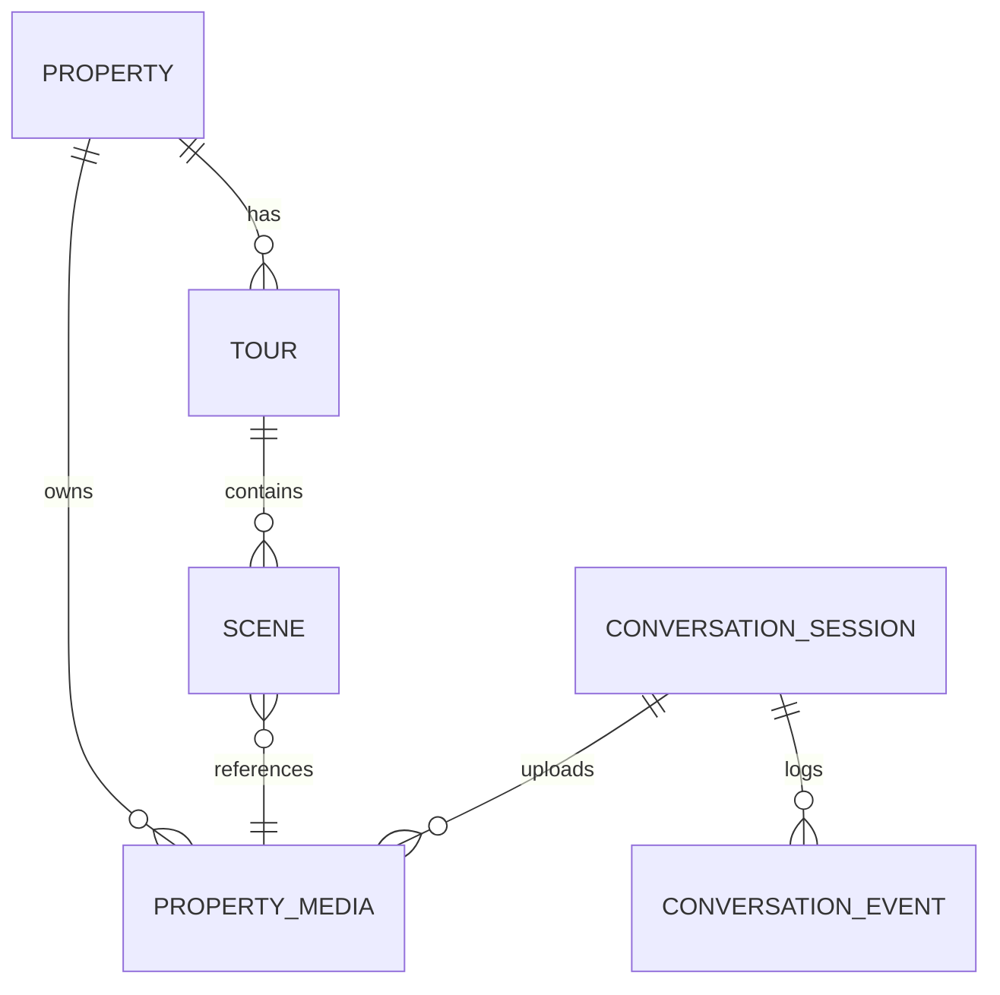

# Conceptual ER Diagram — Conversation Platform (no SQL)

> **SUPERSEDED (2026-08-27).** Pre-implementation draft. There is no separate `Tour` entity in the real schema (see `domain-model.md`'s superseded-notice for detail) and no `status` state machine on `properties` matching `draft | ready_for_processing | ready_for_publish | published | archived` — the real lifecycle is `is_published`/`published_at`/`visibility` plus a separate `listing_status` enum (`available|sold|rented`). See `VIEWORA_ARCHITECTURE_AUDIT.md` (repo root) for the real schema.

Status: Draft

Purpose

High-level, implementation-agnostic Entity-Relationship (ER) diagram for the Conversation Platform and core Viewora domain. This is a conceptual ERD (no SQL) intended to guide schema design and API contracts.

Entities (conceptual attributes)

- Property
  - id (UUID)
  - title
  - address
  - visibility
  - status (draft | ready_for_processing | ready_for_publish | published | archived)

- PropertyMedia
  - id (UUID)
  - property_id (FK)
  - provider_media_id
  - r2_key
  - mime_type
  - status (uploaded_raw | processing | processed | failed)
  - width, height, size_bytes

- Tour
  - id (UUID)
  - property_id (FK)
  - status (draft_preview | published | deprecated)
  - published_at

- Scene
  - id (UUID)
  - tour_id (FK)
  - property_media_id (FK)  # processed manifest / tiles source
  - order_index
  - initial_yaw, initial_pitch, hfov_default

- Hotspot
  - id (UUID)
  - scene_id (FK)
  - type (link | info | media)
  - payload (json)

- ConversationSession
  - id (UUID)
  - channel (whatsapp|telegram|instagram|messenger|webchat)
  - sender_id (string)
  - state (new|active|awaiting_media|waiting_for_processing|completed|abandoned)
  - context (json)
  - last_event_at

- ConversationEvent
  - id (UUID)
  - session_id (FK)
  - direction (inbound|outbound)
  - provider_event_id
  - message_type
  - payload (json)
  - created_at

Relationships (cardinality)

- Property 1 — * PropertyMedia
  - A Property owns many media assets.

- Property 1 — * Tour
  - A Property can have multiple Tours (drafts, published variants).

- Tour 1 — * Scene
  - A Tour is composed of Scenes.

- Scene 1 — 1 PropertyMedia
  - Each Scene references exactly one processed PropertyMedia (manifest/tiles).

- ConversationSession 1 — * ConversationEvent
  - Sessions log many ConversationEvents (inbound/outbound messages and state transitions).

- ConversationSession 1 — * PropertyMedia (optional)
  - During a session, multiple media uploads may be recorded before they are attached to a Property.

Mermaid ER Diagram (conceptual)

Notes and guidance

- This ERD is conceptual. When translating to a relational schema, prefer explicit FK columns and indexes for lookups (e.g., index on `conversation_sessions.sender_id`).
- Use clear, domain-centric table names (`properties`, `property_media`, `tours`, `scenes`, `hotspots`, `conversation_sessions`, `conversation_events`).
- Persist `provider_event_id` on `conversation_events` for dedupe. Keep `conversation_events` append-only for auditability.
- Keep `context` JSON minimal and versioned when schema changes.

Next step

After you approve this conceptual ERD I will produce a detailed API contract that aligns to these entities and the normalized `IncomingMessage` schema.
