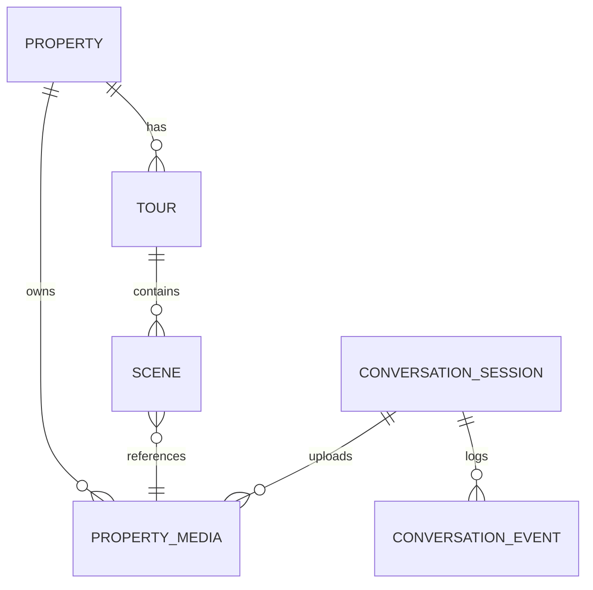
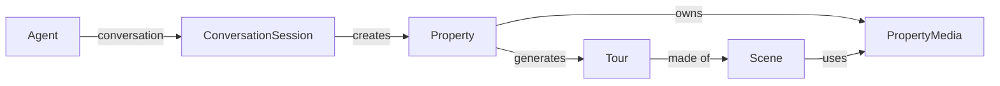

# Viewora — Domain Model

> **SUPERSEDED (2026-08-27).** Pre-implementation draft. The real schema does not have a separate `Tour` entity — a property's 360 experience is `scenes`/`hotspots`/`property_360_settings` rows FK'd directly to `properties`, and photos are `property_media` rows, not a generic `PropertyMedia` type covering both. See `VIEWORA_ARCHITECTURE_AUDIT.md` (repo root) for the real, code-verified schema. Kept for historical context only.

Status: Draft

Purpose

This document defines the core business entities (the language of the domain) for Viewora as a Property Media Platform. It describes responsibilities, relationships, ownership, lifecycle and state transitions at the conceptual/domain level. This file is intentionally implementation-agnostic (no database or code details).

Core Entities

- Property
  - Responsibilities: Represents a real estate asset in Viewora. Owns metadata (title, address, description), configuration (visibility, privacy), and links to media and tours.
  - Why it exists: Central subject for the product — everything (media, tours, publishing) is organized under a Property.

- PropertyMedia (Media)
  - Types: PHOTO, PANORAMA, VIDEO, FLOOR_PLAN, DOCUMENT
  - Responsibilities: Store metadata describing an uploaded asset (origin, uploader, mime type, dimensions, size, processing status, derivatives). Point to stored binaries (R2 keys / URIs) and processing artifacts (tiles, thumbnails, manifests).
  - Why it exists: Media are first-class artifacts that are processed, versioned, and published as part of a Tour.

- Tour
  - Responsibilities: A published or previewable presentation of a Property. Contains ordered Scenes, references to processed media (tiles/manifests), and viewer configuration (hfov, initial yaw/pitch, autoplay settings).
  - Why it exists: The deliverable consumers open and share — the viewer uses Tour objects to render an experience.

- Scene
  - Responsibilities: A single viewpoint or position within a Tour (e.g., a panorama). References a source media asset and processed tile manifests, and may contain hotspots and metadata (order_index, initial_yaw, initial_pitch).
  - Why it exists: Logical subdivision of a Tour; enables navigation between views and mapping of interactive elements.

- Hotspot
  - Responsibilities: Interactive annotations placed on a Scene — link to other scenes, external links, or display content.
  - Why it exists: Provides interactivity and navigation in Tours.

- ConversationSession
  - Responsibilities: Represents a conversation between a user (agent) and the Conversation Platform. Tracks state machine state, associated Property in creation, associated media uploads, and minimal context required to continue a flow.
  - Why it exists: Conversations are long-running processes that must be resumed across messages and time.

- ConversationMessage / ConversationEvent
  - Responsibilities: Append-only audit/log of messages in/out and state transitions for a session. Stores normalized message payload (channel-agnostic) and provider metadata (event id, provider timestamp).
  - Why it exists: Troubleshooting, analytics and eventual replay support.

Relationships & Ownership

- Property 1 — * PropertyMedia
  - A Property owns many PropertyMedia assets. Media have a single canonical owner Property (owner_id), though copies/derivatives may be produced by processing pipelines.

- Property 1 — * Tour
  - A Property can have zero or more Tours (drafts, published instances, or variants). Typically there is one active published Tour.

- Tour 1 — * Scene
  - A Tour is composed of Scenes.

- Scene 1 — 1 PropertyMedia
  - Scenes reference a processed form of a PropertyMedia (tiles/manifest) as their primary visual resource.

- ConversationSession 1 — * PropertyMedia
  - A session may upload multiple media that later become PropertyMedia associated with a Property.

- ConversationSession 1 — 1 Property (draft)
  - During property creation, the session links to the draft Property under construction.

Lifecycle & State Transitions

- Property
  - States: draft → ready_for_processing → processing → ready_for_publish → published → archived
  - Typical transitions:
    - draft → ready_for_processing (after required media uploaded)
    - ready_for_processing → processing (processing job started)
    - processing → ready_for_publish (all assets processed)
    - ready_for_publish → published (explicit publish action)

- PropertyMedia
  - States: uploaded_raw → processing → processed → failed
  - Typical transitions:
    - uploaded_raw → processing (worker picks job)
    - processing → processed (assets written: tiles/manifest/thumb)
    - processing → failed (retry or manual action)

- Tour
  - States: draft_preview → published → deprecated

- ConversationSession
  - States: new → active → awaiting_media → waiting_for_processing → completed → abandoned
  - Typical transitions:
    - new → active (first agent message accepted)
    - active → awaiting_media (engine asks for images)
    - awaiting_media → waiting_for_processing (images uploaded and recorded)
    - waiting_for_processing → completed (processing + publish complete)

Mermaid ER diagram (conceptual)

Mermaid domain diagram (relationships and flows)

Why each entity exists

- `Property`: central business object representing the real estate asset.
- `PropertyMedia`: media are the raw inputs to generate Tours; treating media as separate entities allows re-use, processing tracking, and audit.
- `Tour`: the output product consumers use; separates editing state from the underlying Property.
- `Scene`: organizes presentation and navigation within a Tour.
- `ConversationSession` / `ConversationEvent`: conversation-first UX requires durable session state and a log for recovery and debugging.

Notes

- This domain model deliberately avoids implementation concerns (table names, indexes, job schemas). It focuses on explicit ownership and state transitions so naming in later migrations matches domain intent (e.g., `property_media` vs `media`).
