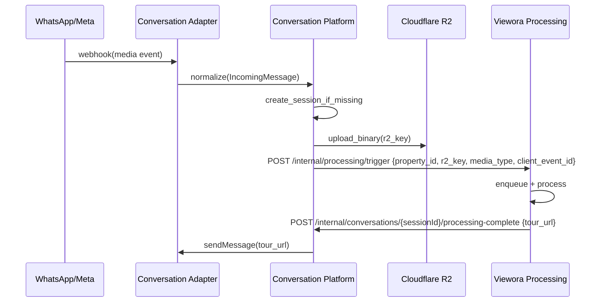

# Conversation Platform — Integration Contract

> **SUPERSEDED (2026-08-27).** Pre-implementation draft. The actual integration is simpler than this: `orchestrator.ts` calls the existing `/spaces` and `/uploads/*` routes directly as a real (anonymous) Supabase-authenticated user — there is no `/internal/processing/trigger` endpoint and no separate processing-complete webhook contract. See `VIEWORA_ARCHITECTURE_AUDIT.md` (repo root) for what's real. Kept for historical context only.

Status: Draft

Purpose

This document specifies the integration contract between the Conversation Platform (adapter + engine) and the existing Viewora backend (property creation, media processing, tour generation). It documents responsibilities, exact handoffs, failure modes, retries and idempotency expectations. This is a design artifact — not an implementation.

High-level responsibilities

- Conversation Platform (Fastify):
  - Accept provider webhooks, verify authenticity, normalize events.
  - Persist ConversationSession and temporary media metadata.
  - Upload raw media to R2 and record R2 keys.
  - Trigger existing Viewora processing flow to convert media into viewer-ready assets and to generate Tours.
  - Notify agent of progress and final published tour link.

- Viewora Backend (existing services: `uploads`, `spaces`, `processing`):
  - Perform media ingestion if a specific protocol is required (presigned URLs, multipart steps).
  - Run processing jobs to generate tiles, manifests, thumbnails, and mark assets ready.
  - Create Tours and publish them for public viewing.

Integration touchpoints (contractual)

1) Property creation
   - Who: Conversation Platform requests Property creation using existing `spaces` RPC or API.
   - Contract: Conversation Platform provides minimal metadata (title, owner_id, draft flag). Viewora backend returns `property_id` and any required upload tokens or expected fields.
   - Idempotency: Conversation Platform must retry safely. If a creation request includes a client-generated idempotency key, the backend should deduplicate.

2) Media upload (raw binary)
   - Who: Conversation Platform adapter fetches media binary from provider (e.g., Meta) and uploads to R2.
   - Contract: Conversation Platform uploads binary to R2 at a deterministic key pattern (e.g., `properties/{property_id}/source/{uuid}.{ext}`) and returns the R2 key to the processing system.
   - Alternative: If existing backend requires presigned upload, Conversation Platform calls the `uploads` service to obtain an upload URL; if so, Conversation Platform must follow that flow.

3) Processing trigger
   - Who: Conversation Platform calls a processing trigger endpoint on the existing backend to enqueue processing for the newly uploaded R2 object.
   - Contract: HTTP POST to `POST /internal/processing/trigger` (example; actual endpoint to be mapped) with payload:
     - `property_id` — id of the property
     - `r2_key` — location of raw media
     - `media_type` — PHOTO/PANORAMA/VIDEO/FLOOR_PLAN/DOCUMENT
     - `source` — `conversation_platform`
     - `client_event_id` — provider event id for idempotency
   - Response: `202 Accepted` with `job_id` or `200 OK` with processing status.
   - Idempotency: The receive side must dedupe on `client_event_id` and `r2_key`.

4) Processing completion and tour generation
   - Who: Viewora processing pipeline updates metadata (e.g., sets `tiles_ready` on scenes and calls internal tour generation RPC).
   - Contract: Processing pipeline writes the necessary references for Scenes and returns `tour_id` or updates `property` to `ready_for_publish`.
   - Notification options:
     - Push: Processing pipeline calls Conversation Platform webhook (e.g., `POST /internal/conversations/:sessionId/processing-complete`) with `tour_url`.
     - Pull: Conversation Platform polls a `property` or `media` endpoint until `ready`.
   - Recommendation: For S1, use push notifications from processing into Conversation Platform to minimize polling.

5) Tour publication
   - Who: Viewora backend performs the publish operation and returns a public URL (or share link id). Conversation Platform sends the URL to the agent.

Failure scenarios and retries

- Media fetch from provider fails (transient network or provider-side error)
  - Retry policy: 3 attempts with exponential backoff; save failure into ConversationEvent for later manual inspection.
  - Fallthrough: if repeated failures occur, notify agent and mark session `awaiting_media` or `failed_media_upload`.

- R2 upload fails
  - Retry policy: 3 attempts with exponential backoff; if persistent, mark media row `failed` and notify.

- Processing trigger fails (backend internal 5xx)
  - Retry: enqueue a retry with exponential backoff. If transient, processing will eventually start. If persistent, surface admin-facing error.

- Duplicate webhooks / duplicate provider event delivery
  - Deduplication: Conversation Platform must persist provider `client_event_id` (provider event id) and ignore repeating event ids. For media, dedupe by `provider_media_id` + `r2_key` combination.

Idempotency rules

- All externally visible side effects must be idempotent with respect to a `client_event_id` or `request_id` produced by the provider/adapter.
- Property creation: include `client_generated_id` in creation call and reject duplicates as no-ops.
- Processing trigger: dedupe on `r2_key` + `client_event_id`.

Sequence diagrams

Inbound media flow (normalized)

Exact service responsibilities (mapping)

- `Conversation Platform` (Fastify):
  - Provider webhook receiver and normalization.
  - R2 upload client (S3-compatible) for raw binaries.
  - Session and media metadata recording.
  - Call `processing/trigger` endpoint and accept processing-complete webhooks.
  - Send outbound messages via provider send API.

- `Uploads/Processing` (existing Viewora backend components):
  - Accept processing triggers, perform media processing and create viewer artifacts.
  - Produce final `tour_url` (or signal that property is ready for publish).

Contract constraints

- The Conversation Platform must never reimplement core processing or Tour generation. It must be an adapter and orchestrator only.
- Conversations must be resumable; state transitions persisted to durable storage.
- All cross-service calls must include `client_event_id` for idempotency.

Security & authentication

- Conversation Platform must authenticate to internal endpoints (mutual TLS, API key or signed JWT) for `processing/trigger` and processing-complete webhooks.

Operational notes

- For S1, map the `processing/trigger` to an existing internal endpoint (to be determined by reviewing `src/routes/uploads.ts` and `src/routes/spaces.ts`).
- If no internal trigger exists, Conversation Platform can mark a `pending` row and the existing worker process can pick it up.
