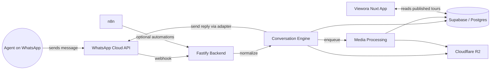
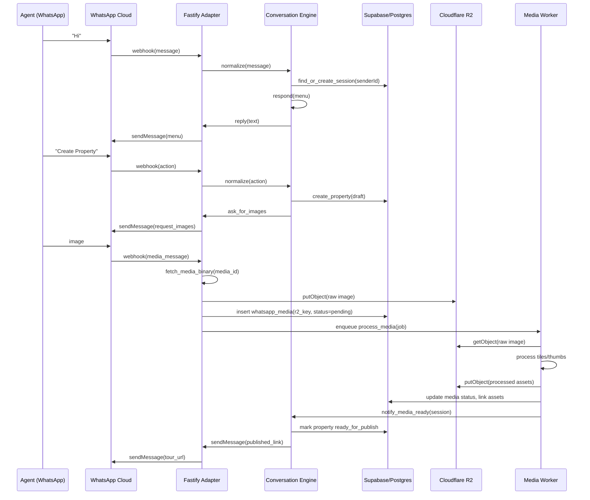
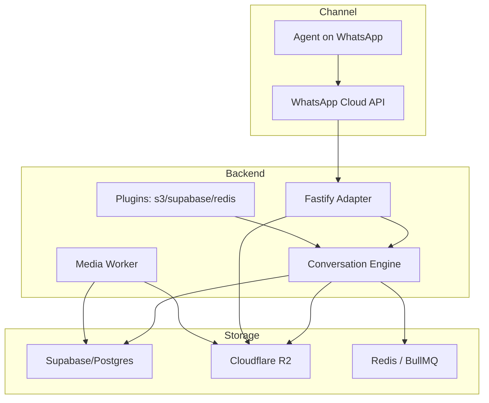

# Viewora — WhatsApp Conversation Platform (Technical Design)

> **SUPERSEDED (2026-08-27).** This is a pre-implementation design draft describing an approach that was NOT what got built. The real, working implementation lives in `src/conversation/{engine,orchestrator,repository,types}.ts` and `src/adapters/telegram/`, is channel-agnostic and Telegram-proven today, and differs from this doc in several load-bearing ways (no `/internal/processing/trigger` endpoint, no separate `Tour` entity distinct from `Property`, no `X-Hub-Signature`-verified WhatsApp adapter yet — `routes/whatsapp.ts` is still a stub). See `VIEWORA_ARCHITECTURE_AUDIT.md` (repo root) for what's actually implemented and what's still missing. Kept for historical context only — do not build against this document.

Status: Draft

This document describes the architecture and design for the WhatsApp Conversation Platform feature (MVP). It defines goals, components, request flows, database requirements, API endpoints, environment variables, and diagrams. No business logic is implemented in code — this is a design-only artifact to review before further implementation.

## 1. Goals

### Problem statement

Real estate agents need a fast, low-friction way to create and publish Viewora tours via a conversational channel (WhatsApp). Agents should be able to: create a property, upload images, and receive a shareable tour link — all from WhatsApp.

### MVP scope

- Accept incoming WhatsApp messages via the Meta (WhatsApp Cloud) API.
- Provide a minimal conversational flow that: greets, offers a menu, creates a property record, accepts image uploads, triggers processing, and returns a published tour link.
- Keep business logic in the Conversation Engine; adapters normalize channel messages to a single IncomingMessage model.
- Persist sessions and media metadata in the database (Supabase/Postgres).
- Store uploaded media in Cloudflare R2.

### Out-of-scope for MVP

- In-chat payments or billing flows.
- Advanced NLP or AI-driven intent classification (beyond simple state machine / rule-based flow).
- Full image processing pipeline tuning; only triggers to existing processing services.
- Integrations with other channels (Telegram, Instagram) — planned for future.

## 2. Overall Architecture

High-level components:

- WhatsApp Cloud API (Meta): receives inbound messages and delivers webhook events; used to send outbound messages.
- n8n: lightweight orchestration for non-core automations (e.g., notification fallbacks, low-code triggers); optional for this MVP.
- Fastify Backend (this repo): hosts channel adapters, Conversation Engine, API surface, repositories, and admin/debug endpoints.
- Supabase (Postgres + Auth): stores sessions, conversation events, media metadata, and business data.
- Cloudflare R2: object storage for uploaded images and generated assets.
- Viewora App (Nuxt): front-end used by agents to manage tours — receives published tour links.

Diagram (architecture):



## 3. Request Flow (end-to-end)

This example flow covers: user says "Hi" → menu → property creation → image upload → processing → published tour.

1. User sends "Hi" from WhatsApp
   - Meta (WhatsApp Cloud) posts webhook event to Fastify `/whatsapp/webhook`.
2. Fastify adapter
   - Validates signature (if configured).
   - Normalizes event into `IncomingMessage`:
     ```ts
     interface IncomingMessage {
       channel: 'whatsapp'
       senderId: string
       type: 'text' | 'image' | 'button' | 'list' | 'unknown'
       payload: unknown
       timestamp: string
     }
     ```
3. Conversation Engine receives normalized message
  - Loads/creates a `ConversationSession` (conversation state).
  - Determines current state and next action (greeting/menu).
  - Persists `ConversationEvent` entries for auditing.
4. Engine issues reply via adapter
   - Adapter formats reply per WhatsApp Cloud API and calls Meta send endpoint.
5. Agent chooses "Create Property"
   - Engine transitions session state to `creating_property` and requests property fields (title, address, etc.).
6. Agent uploads images (WhatsApp image messages)
  - Adapter fetches media from Meta using media id, stores binary in R2, and creates `PropertyMedia` (or a draft `property_media` record) with R2 URL and status `pending`.
  - Engine records events and triggers the ProcessingPipeline (enqueue job or call internal processing trigger).
7. ProcessingPipeline (background worker)
  - Picks `property_media` rows, processes tiles/thumbnails, writes processed assets to R2, updates DB status.
  - When all required assets ready, triggers tour generation flow (existing upload completion hooks), marks Property as `ready_for_publish`.
8. Conversation Engine notifies agent
   - Sends published tour link (short URL or full viewer URL) via WhatsApp message.
9. Agent or public user opens link in Viewora App, tour served from frontend using DB + R2 assets.

## 4. Component Responsibilities

- n8n
  - Optional: non-core orchestrations like notifying Slack, sending emails, or low-privilege webhooks when specific events happen.
  - Should not contain core conversation state machine logic.

- Fastify Backend
  - Channel adapters (WhatsApp adapter): normalize incoming events and provide send helpers.
  - Conversation Engine: core state machine to handle session lifecycle, actions, and event persistence.
  - Repositories: CRUD access to Supabase/Postgres for sessions, media, and events.
  - Plugins: initialize external clients (R2 S3 client, Supabase client, optional WhatsApp SDK wrapper).
  - Admin/debug routes and health endpoints.

- Database (Supabase/Postgres)
  - Tables for sessions, media, conversation events, and property metadata.
  - Store durable state and event history for audit and retry logic.

- Cloudflare R2
  - Store raw uploaded media and processed assets (tiles, thumbnails).
  - Serve assets to frontend and media pipeline.

- Viewora Nuxt App
  - Display published tours and allow agents to manage tours (outside the WhatsApp flow).

## 5. Proposed Backend Folder Structure

We will add a `src/whatsapp` feature area while keeping the existing `src/plugins` and `src/routes`. The structure below is focused on the Conversation Platform concept.

```
src/
 ├── whatsapp/
 │   ├── controllers/
 │   │   └── webhook.controller.ts    # route handlers that call services
 │   ├── services/
 │   │   ├── conversation.service.ts  # state machine + orchestration
 │   │   ├── media.service.ts         # handles media fetch + store
 │   │   └── whatsapp.service.ts      # adapter: send/receive + normalization
 │   ├── repositories/
 │   │   └── session.repository.ts
 │   ├── types/
 │   │   └── whatsapp.types.ts
 │   ├── validators/
 │   │   └── webhook.validator.ts
 │   ├── routes/
 │   │   └── whatsapp.ts             # wires controller into Fastify
 │   └── index.ts                    # feature entry (optional)
 ├── plugins/
 │   └── whatsapp.ts                 # fastify plugin/decorator for clients
```

Notes:
- Keep route modules under `src/routes` compatible with current index.ts imports to keep registration consistent.
- Keep new feature code typescriptified and testable with small unit tests.

## 6. Required Database Tables

Minimal tables (columns are examples):

1. `conversation_sessions`
  - `id` UUID PK
  - `channel` TEXT (e.g., 'whatsapp')
  - `sender_id` TEXT (WhatsApp phone id)
  - `state` TEXT
  - `context` JSONB (session-specific data)
  - `last_event_at` TIMESTAMP
  - `created_at`, `updated_at`

2. `property_media`
  - `id` UUID PK
  - `session_id` UUID FK -> conversation_sessions
  - `provider_media_id` TEXT (provider media reference id from Meta)
  - `r2_key` TEXT (object key)
  - `mime_type` TEXT
  - `status` TEXT (pending/processing/complete/failed)
  - `width`, `height`, `size_bytes`
  - `created_at`, `updated_at`

3. `conversation_events`
   - `id` UUID PK
   - `session_id` UUID FK
   - `event_type` TEXT (message_in, message_out, state_transition, error)
   - `payload` JSONB
   - `created_at`

4. (Optional) `conversation_jobs`
   - For tracking processing jobs, retries and worker outcomes.

Indexing and retention:
- Index on `sender_id` and `last_event_at` for session lookups.
- TTL/retention policy for old sessions/events depending on compliance.

## 7. Required API Endpoints

Adapter endpoints (Fastify routes) — primarily internal/public webhook endpoints:

- `POST /whatsapp/webhook`
  - Purpose: receive WhatsApp events from Meta and enqueue/forward to Conversation Engine.
  - Security: verify `X-Hub-Signature` if configured.

- `GET /whatsapp/health`
  - Purpose: simple health check for WhatsApp integration.

Administrative / developer endpoints (optional):

- `POST /whatsapp/test-send` (auth-only)
  - Purpose: send a test message to a number using stored token (debug).

- `GET /whatsapp/sessions/:senderId` (auth-only)
  - Purpose: inspect session state for a sender.

Public-facing APIs for other services to trigger flows (optional):

- `POST /conversations/:sessionId/continue`
  - Purpose: allow internal systems to resume or push events into a session.

## 8. Environment Variables

Suggested variables (to be documented in README or secrets manager):

- `WHATSAPP_VERIFY_TOKEN` — webhook verification token (if used).
- `WHATSAPP_APP_SECRET` — app secret for signature verification (HMAC).
- `WHATSAPP_ACCESS_TOKEN` — token used to send messages via Meta API.
- `WHATSAPP_PHONE_NUMBER_ID` — the phone number id used in Meta API requests.
- `SUPABASE_URL`, `SUPABASE_SERVICE_KEY` — DB and auth access.
- `R2_ACCOUNT_ID`, `R2_BUCKET_NAME`, `R2_ACCESS_KEY_ID`, `R2_SECRET_ACCESS_KEY` — Cloudflare R2 credentials.
- `REDIS_URL` — for job queue (BullMQ) to process media.
- `MEDIA_PROCESSOR_QUEUE_NAME` — queue name for media processing jobs.
- `NODE_ENV`, `PORT` — standard runtime variables.

Secrets should be stored in Railway/Cloud environment variables or a secrets manager — not in code.

## 9. Future scalability considerations

- Adapter and normalization
  - Keep adapter stateless; persist session state in DB so multiple Fastify instances can handle traffic.

- Horizontal scaling
  - Fastify instances behind a load balancer; all state in DB and Redis for queues.

- Media pipeline
  - Use worker processes (BullMQ) to scale processing; use R2 for bandwidth and CDN.

- Events and auditing
  - Keep conversation events immutable for replay and audit; use event stream if scale increases.

- Idempotency and retries
  - Webhook handling must be idempotent (dedupe by event id). Persist event ids in `conversation_events`.

- Monitoring and observability
  - Expose health endpoints (done). Add metrics for incoming events, queue depths, processing errors, and R2 failures.

## 10. Sequence Diagrams

### User greeting → create property → upload image → publish



## 11. Architecture Diagram (Component-level)



## 12. Deliverables for next iteration (after review)

1. Create the file/folder scaffolding as described in Section 5 with placeholder files and TODOs (no business logic).
2. Create DB migration SQL for the three tables in Section 6 (for Cosmas to review and run).
3. Implement adapter-level media fetch + R2 upload (minimal, tested) as a separate PR.
4. Build Conversation Engine minimal state machine (greeting/menu/create property) using repository interfaces.

---

End of document.
